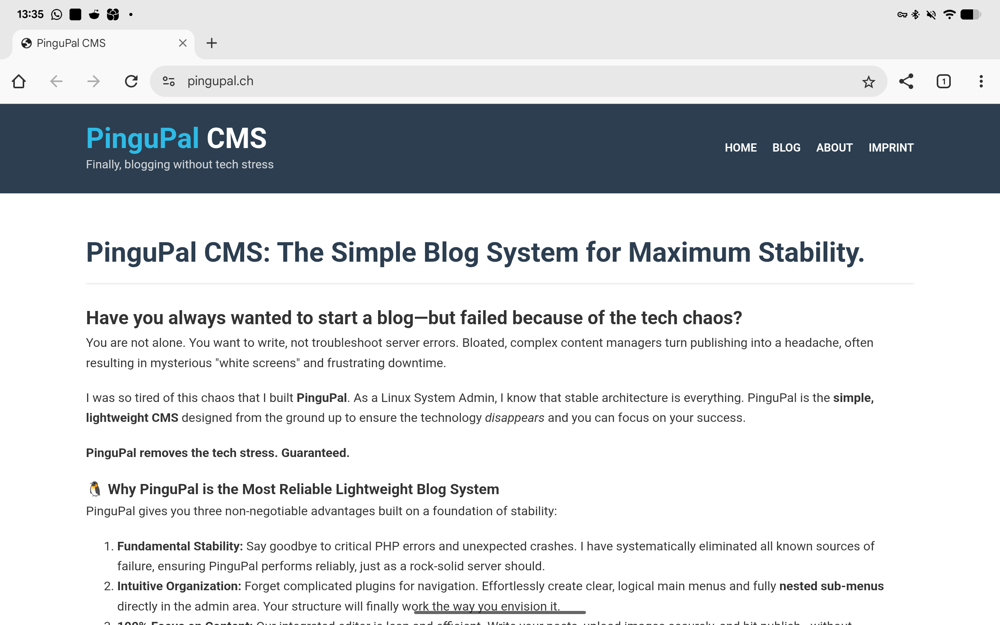
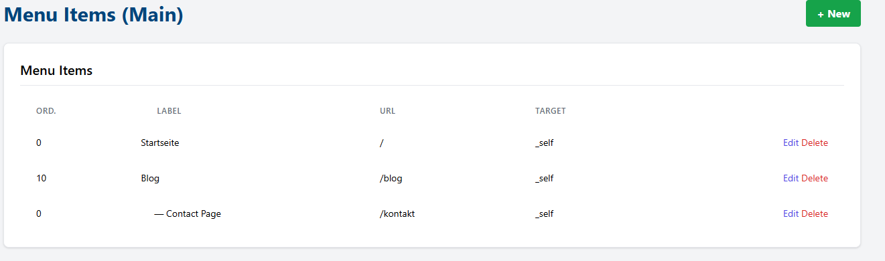
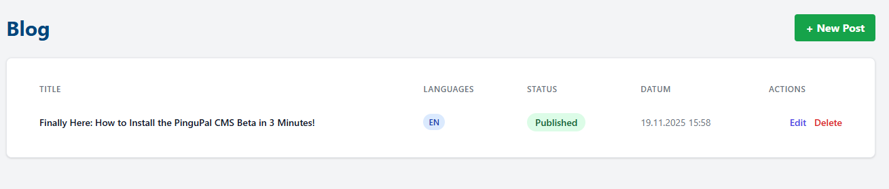
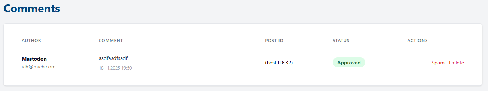

  <h1>🐧 PinguPal CMS</h1>

  
  
  

  

    <em>(English version below)</em>
  

<h2>🇩🇪 Deutsch: Über PinguPal CMS</h2>

  <strong>PinguPal CMS</strong> ist ein modernes, leichtgewichtiges und benutzerfreundliches Content Management System (CMS), 
  das speziell für Blogs und statische Webseiten entwickelt wurde. Es verzichtet auf den Ballast grosser Frameworks und bietet eine schnelle, 
  sichere und einfach zu bedienende Plattform – entwickelt mit ❤️ in der Schweiz 🇨🇭.

<h3>🚀 Hauptfunktionen</h3>

<ul>
  <li><strong>Einfache Installation:</strong> Ein integrierter Installer (<code>install.php</code>) führt dich in wenigen Schritten zur fertigen Webseite.</li>
  <li><strong>Moderner Editor:</strong> Nutze den <strong>Quill Rich-Text Editor</strong> für deine Inhalte. Neu inklusive <strong>HTML-Quellcode-Modus</strong> für volle Kontrolle.</li>
  <li><strong>SEO-Optimiert:</strong> Volle Kontrolle über Meta-Titel, Beschreibungen, Keywords und Robots-Tags (Index/NoIndex).</li>
  <li><strong>Design & Themes:</strong> Wähle aus verschiedenen Farbschemata (Standard, Dark Mode, Nature, Coffee) oder passe das Design komplett an (Pro).</li>
  <li><strong>Sicherheit:</strong>
    <ul>
      <li><strong>2-Faktor-Authentifizierung (2FA):</strong> Schütze deinen Admin-Login mit Google Authenticator (TOTP).</li>
      <li>Sichere Passwort-Hashes und geschützte Sessions.</li>
    </ul>
  </li>
  <li><strong>Social Media & Crossposting:</strong> Verlinke deine Profile im Footer und poste Blog-Beiträge automatisch auf <strong>Mastodon</strong>.</li>
  <li><strong>Kommentare:</strong> Integriertes Kommentarsystem mit Moderations-Warteschlange.</li>
  <li><strong>Lizenz-System:</strong> Unterstützung für Free, Ko-Fi (Supporter) und Pro-Lizenzen mit erweiterten Funktionen (z.B. White-Labeling).</li>
</ul>

<h3>🛠️ Installation</h3>

<ol>
  <li>Lade den Quellcode herunter und entpacke ihn auf deinen Webserver.</li>
  <li>Erstelle eine leere MySQL/MariaDB Datenbank.</li>
  <li>Rufe deine Domain im Browser auf (z.B. <code>deine-seite.ch/install.php</code>).</li>
  <li>Folge den Anweisungen des Installers.</li>
</ol>

<h3>📋 Anforderungen</h3>

<ul>
  <li>PHP 8.0 oder höher</li>
  <li>MySQL oder MariaDB Datenbank</li>
  <li>PHP-Erweiterungen: <code>pdo</code>, <code>pdo_mysql</code>, <code>mbstring</code>, <code>zip</code></li>
</ul>

<h2>🇺🇸 English: About PinguPal CMS</h2>

  <strong>PinguPal CMS</strong> is a modern, lightweight, and user-friendly Content Management System (CMS) designed specifically for blogs and static websites. 
  It avoids the bloat of large frameworks, offering a fast, secure, and easy-to-use platform – made with ❤️ in Switzerland 🇨🇭.

<h3>🚀 Key Features</h3>

<ul>
  <li><strong>Easy Installation:</strong> An integrated installer (<code>install.php</code>) guides you to a ready-to-use website in just a few steps.</li>
  <li><strong>Modern Editor:</strong> Use the <strong>Quill Rich-Text Editor</strong> for your content. Now includes <strong>HTML Source Mode</strong> for full control.</li>
  <li><strong>SEO Optimized:</strong> Full control over meta titles, descriptions, keywords, and robots tags (Index/NoIndex).</li>
  <li><strong>Design & Themes:</strong> Choose from various color schemes (Default, Dark Mode, Nature, Coffee) or fully customize the design (Pro).</li>
  <li><strong>Security:</strong>
    <ul>
      <li><strong>Two-Factor Authentication (2FA):</strong> Protect your admin login using Google Authenticator (TOTP).</li>
      <li>Secure password hashing and protected sessions.</li>
    </ul>
  </li>
  <li><strong>Social Media & Crossposting:</strong> Link your profiles in the footer and automatically crosspost blog entries to <strong>Mastodon</strong>.</li>
  <li><strong>Comments:</strong> Integrated comment system with a moderation queue.</li>
  <li><strong>License System:</strong> Support for Free, Ko-Fi (Supporter), and Pro licenses with advanced features (e.g., White-Labeling).</li>
</ul>

<h3>🛠️ Installation</h3>

<ol>
  <li>Download the source code and unzip it to your web server.</li>
  <li>Create an empty MySQL/MariaDB database.</li>
  <li>Open your domain in the browser (e.g., <code>your-site.com/install.php</code>).</li>
  <li>Follow the installer instructions.</li>
</ol>

<h3>📋 Requirements</h3>

<ul>
  <li>PHP 8.0 or higher</li>
  <li>MySQL or MariaDB database</li>
  <li>PHP Extensions: <code>pdo</code>, <code>pdo_mysql</code>, <code>mbstring</code>, <code>zip</code></li>
</ul>

<h3>📷 Screenshots</h3>

  
  
  
  
  
  
  

<h3>📄 License</h3>

This project is licensed under the <strong>MIT License</strong> - see the <a href="LICENSE">LICENSE</a> file for details.

<em>Dependencies:</em>

<ul>
  <li><a href="https://quilljs.com/">QuillJS</a> (BSD-3-Clause)</li>
  <li><a href="https://github.com/PHPMailer/PHPMailer">PHPMailer</a> (LGPL-2.1)</li>
  <li><a href="https://tailwindcss.com/">Tailwind CSS</a> (MIT - via CDN)</li>
</ul>
